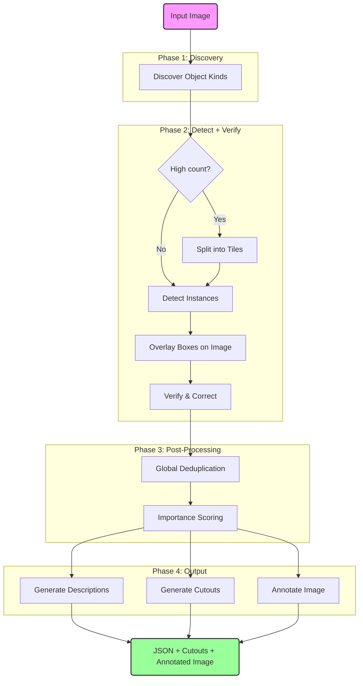

# deep-label

**deep-label** is an intelligent, agentic computer vision pipeline designed to analyze complex artwork with “obnoxiously exhaustive” detail.

Unlike standard object detection models that only find the most obvious elements (e.g., "person," "dog"), this system uses a **recursive feedback loop** to force Large Language Models (LLMs) to look deeper, identifying specific background details, individual crowd members, and subtle narrative elements.

It then uses this exhaustive data as "Ground Truth" to generate high-quality, hallucination-free accessibility descriptions (Alt Text and Long Descriptions) for museum contexts.

---

## 📖 Non-Technical Overview

Imagine asking a curator to list everything they see in a painting.
1.  **First pass:** They list the main subjects—the castle, the king, the river.
2.  **Second pass:** You hand them their own list and say, *"These are already labeled. What else do you see?"* They look closer and list the hunters, the boat, and the dogs.
3.  **Third pass:** You repeat the process. Now they are squinting at the background, listing the tiny village, the birds in the trees, and the specific clothing of the servants.

**deep-label** automates this process. It refuses to stop until it has "squeezed" every drop of visual information from the image.

Once it has a massive list of verified facts, it passes that list to a "Writer" agent. Because the Writer has a verified list of facts, it doesn't make things up. It knows exactly how many dogs are in the pack and exactly where they are standing, resulting in a highly accurate visual description.

---

## 🔄 System Flow



---

## ⚙️ How It Works

### Phase 1: Kind Discovery
The agent first asks Gemini to list the unique **kinds** of objects visible in the artwork (e.g., "Hound", "Stag", "Hunter", "Castle"), along with estimated counts.

### Phase 2: Detect + Verify (per kind)
For each discovered kind:
1. **Detection:** Find all instances of that kind with bounding boxes
2. **Verification:** Show the model its own boxes overlaid on the image and ask it to:
   - Remove incorrect boxes
   - Correct misaligned boxes
   - Add any missed instances
3. **Tiled detection:** For high-count kinds (e.g., 50+ hounds), the image is split into overlapping tiles and each tile is processed independently, then merged with deduplication

All coordinates are normalized to `[0-1000]` integers. Schema enforcement via Zod ensures structured JSON output.

### Phase 3: Global Deduplication & Scoring
After all kinds are processed:
- Geometry-based deduplication merges overlapping boxes (alternate labels preserved as `aliases`)
- Importance scoring ranks objects by size, centrality, and rarity

### Phase 4: Description Generation
The verified object list is passed to a "Writer" agent that generates:
- **Alt text** (10-18 words): concise scene summary
- **Long description** (150-200 words): detailed spatial walkthrough

Because the writer has a verified list of facts, it doesn't hallucinate—it knows exactly how many dogs are in the pack and where they're standing.

---

## 🛠️ Tech Stack

*   **Runtime:** Node.js / TypeScript
*   **AI Framework:** [Vercel AI SDK](https://sdk.vercel.ai/docs) (`generateObject`)
*   **Model Provider:** Google Generative AI (Gemini)
*   **Validation:** Zod (Schema validation)
*   **Visualization:** `sharp` + SVG overlay (annotated output image)

---

## 🚀 Getting Started

### 1. Installation
```bash
npm install
```

### 2. Environment Setup
Create a `.env` file:
```env
GOOGLE_GENERATIVE_AI_API_KEY=your_api_key_here
```

### 3. Process an Artwork
Create an artwork directory and add your image:
```bash
mkdir -p public/artworks/my-painting
cp path/to/image.jpg public/artworks/my-painting/
```

Optionally add metadata (`artwork.json`):
```json
{"title": "My Painting", "artist": "Jane Doe", "date": "1850", "medium": "Oil on canvas"}
```

Run the detection agent:
```bash
npx tsx scripts/agent.ts my-painting
```

This generates all outputs in the artwork directory:
- `detected_objects.json` - detection payload with objects and descriptions
- `cutouts/` - cropped images for each detected object
- `cutouts.json` - cutout index
- `annotated.png` - image with bounding box overlays

### 4. View Results
Start the web viewer:
```bash
npm run dev
```
Open http://localhost:3000 to browse artworks with an interactive zoomable viewer.

### CLI Options
```
npx tsx scripts/agent.ts <slug> [options]

Options:
  --force                  Overwrite existing outputs
  --max-kinds <n>          Max object kinds to discover (default: 50)
  --verify-rounds <n>      Verification rounds per kind (default: 2)
  --tile-threshold <n>     Use tiled detection above this count (default: 12)
  --kind-concurrency <n>   Parallel kind processing (default: 3)
  --cutouts-padding <pct>  Padding around cutouts (default: 0.10)
  --no-cutouts             Disable cutout generation
  --model <name>           Override detection model
  -h, --help               Show all options
```

---

## 📊 Data Format

The output `detected_objects.json` contains:

```json
{
  "strategy": "hybrid-detect-verify",
  "image_path": "public/artworks/my-painting/image.jpg",
  "model_name": "gemini-3-pro-preview",
  "kinds": [
    { "kind": "Hound", "type": "animal", "estimated_count": "many" }
  ],
  "objects": [
    {
      "label": "Hound",
      "type": "animal",
      "box_2d": [80, 640, 155, 780],
      "importance": 0.42,
      "importance_rank": 5
    }
  ],
  "descriptions": {
    "alt_text": "A hunting party with riders and hounds chases a stag...",
    "long_description": "..."
  }
}
```

**Coordinates:** `box_2d` is `[xmin, ymin, xmax, ymax]` normalized to `[0, 1000]`.

**Per-object fields:**
* `importance`: 0–1 score based on size, centrality, and rarity
* `importance_rank`: 1 = most important
* `aliases`: alternate labels merged during deduplication

---

## Project Structure

```
scripts/           # CLI tools
  agent.ts         # detection agent
  annotator.ts     # image annotation helper
src/               # Next.js web viewer
public/artworks/   # artwork data (per-slug directories)
```

## Notes

* **Model overrides:** Use `--model <name>` or `MODEL_NAME` env var if Gemini model names change.
* **Tiled detection:** For dense scenes (many instances of a kind), the agent automatically splits the image into tiles for better coverage.
* **Importance scoring:** Objects are ranked by geometric importance (size, centrality, rarity) for UI prioritization.
* **Cutout padding:** Configurable via `--cutouts-padding` (default 10%) to include context around detected objects.
