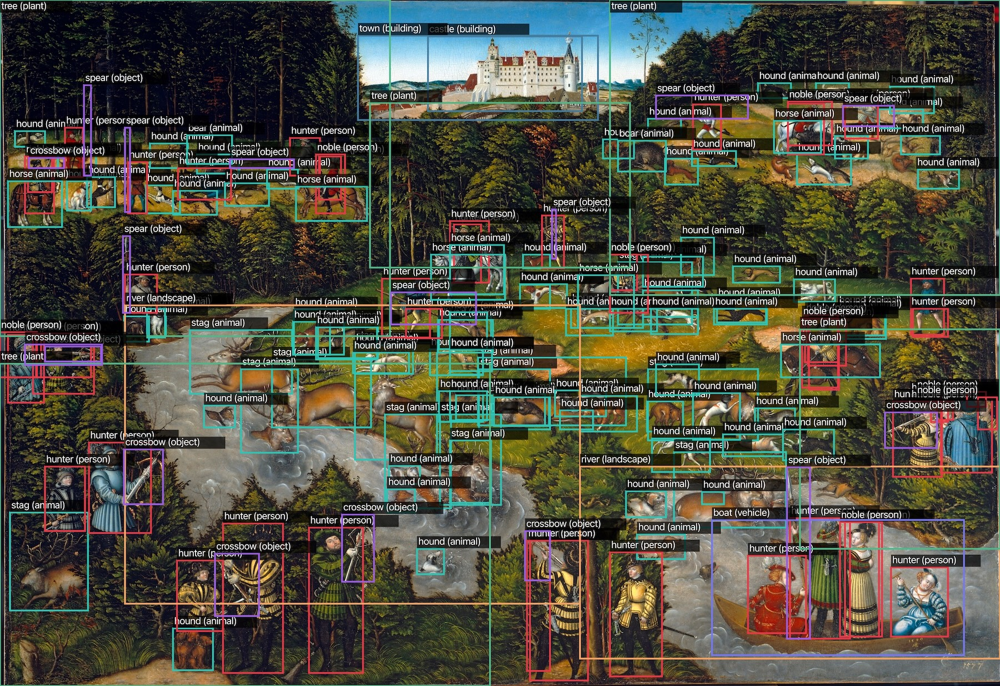
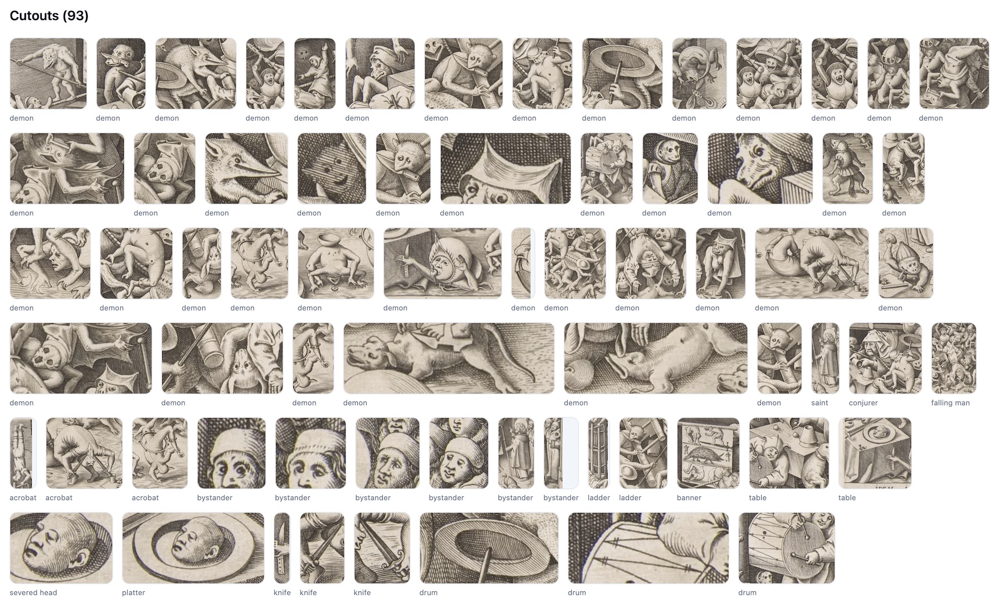
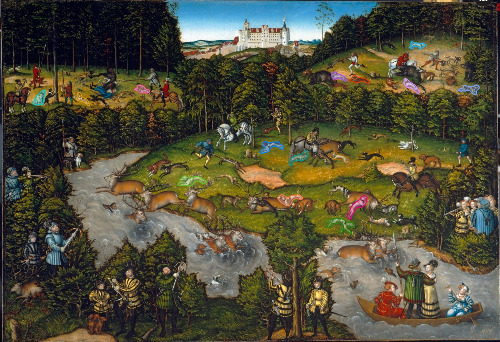
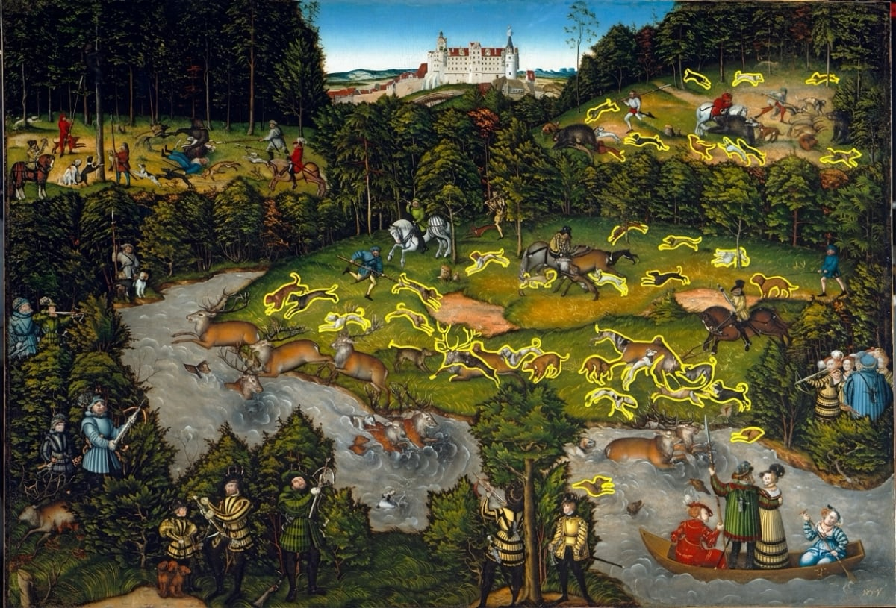
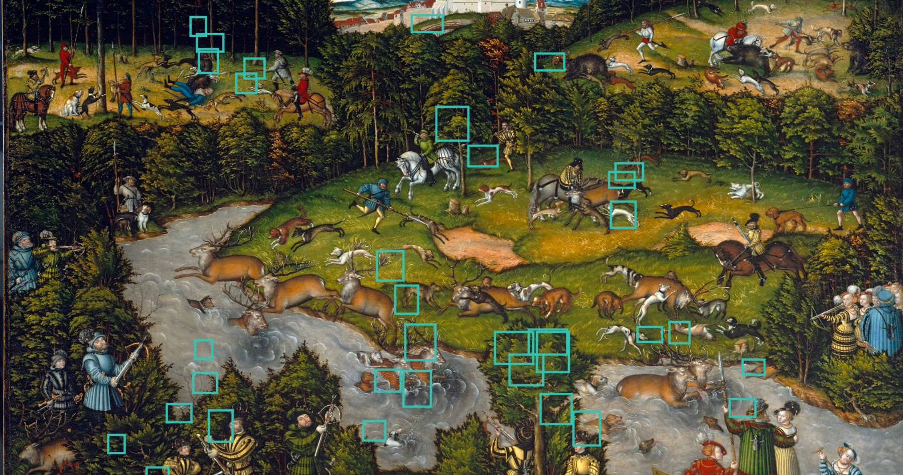

# deep-label

## Introduction

**Derek: I've been dreaming of an IIIIF, "Intelligent IIIF" framework, one which can deeply analyze and describe images at various scales. This Opus 4.5 vibe-coded proof-of-concept is a step in that direction. `src/lib/detector.ts` was iterated upon many times, it should be refactored into an elegant, generalized algorithm for recursive, multi-scale discovery & verification with "attention" passing spatially-attributed context at smaller scales.  _Ideally, each step would include not only object type identification and object segmentation but also visual description generation._ One of my sub-goals is to find all "cats" in all artworks. The object "cutouts" could be used as part of a search UI, or even to train models.**

Opus 4.5: Currently the code is 2-level (full → quadrants). A truly recursive version would:
  - Subdivide adaptively based on object density/size
  - Pass context downward (what the parent scale saw)
  - Bubble findings upward with spatial attribution
  - Allow N levels deep, not just 2





---


**deep-label** is an intelligent, agentic computer vision pipeline designed to analyze complex artwork with exhaustive detail.

Unlike standard object detection models that only find the most obvious elements (e.g., "person," "dog"), this system uses a **multi-scale discovery** and **reconciliation** approach to force Large Language Models (LLMs) to look deeper, identifying specific background details, individual crowd members, and subtle narrative elements.

It then uses this exhaustive data as "Ground Truth" to generate high-quality, hallucination-free accessibility descriptions (Alt Text and Long Descriptions) for museum contexts.

---

## The Problem

### 1. The Metadata Gap
Museums index titles, not pixels. Search for "dog" and you get paintings *named* "dog" — not the thousands where a dog appears in the background. **Deep-label turns visual content into searchable data.**

### 2. The Domain Shift Problem
Standard vision models (YOLO, COCO) are trained on photographs. They see brushstrokes as noise and stylization as error. A Cubist face registers as not-a-face. **This pipeline focuses on structure over style** — recognizing a "person" whether rendered by Vermeer or Picasso.

### 3. Distant Viewing
Art history is traditionally qualitative — a scholar manually studies hundreds of works in a career. **Automated labeling enables macro-analysis**: track how "hands" evolved from Medieval to Renaissance across 100,000 images.

### 4. Accessibility at Scale
Alt-text for museum collections is scarce and expensive to produce manually. **Deep-label generates rich, hierarchical descriptions automatically** — enabling screen readers, audio tours, and region-based exploration for visually impaired users.

**In short:** Current AI sees art as broken photos. Current museum databases are blind to their own visual content. This project bridges both gaps.

### Why Existing Tools Fail

Consider a [complex hunting scene](https://www.clevelandart.org/art/1958.425) with dozens of hounds. Here's what happens when you try existing approaches:

| Approach | Result |
|----------|--------|
|  | **Segmentation models** like [Meta SAM 3](https://ai.meta.com/sam3/) excel at pixel-perfect boundaries but often lack the semantic flexibility for stylized art. They struggle to map specific iconography (e.g., "demon") to general classes they were trained on (e.g., "person"). While SAM 3 improves on this, it still suffers from low recall in dense scenes, identifying only 15 "hounds" here where dozens exist. |
|  | **Image generators** like [Nano Banana Pro](https://gemini.google/overview/image-generation/) can be asked to visually "highlight the hounds." While useful for general localization, generative models prioritize global image coherence over exhaustive extraction. As a result, it highlights the most obvious clusters but misses individual outlying instances. |
|  | **VLM direct prompting**: Asking [Gemini 3](https://gemini.google.com/) for direct bounding box coordinates works well on simple photos but suffers from coordinate drift in complex art. The model correctly perceives the density (returning ~36 instances), but lacks the precision to ground them accurately, resulting in "floating" boxes that don't align with the pixels. |

**deep-label** solves this with multi-scale discovery, LLM-based reconciliation, and iterative verification to achieve exhaustive coverage without hallucination.

---

## How It Works

### Phase 1: Multi-Scale Discovery + Reconciliation

The agent analyzes the artwork at multiple scales, then reconciles findings with full-image context to filter hallucinations:

**Step 1a: Full image analysis**
- Identifies major elements visible at full scale

**Step 1b: Quadrant analysis**
- 4 overlapping quadrants at 55% size catch small details missed at full scale
- Each quadrant is analyzed independently

**Step 1c: Reconciliation (key innovation)**
- All discoveries (full + quadrant) are sent back to the LLM with the full image
- The LLM filters artifacts (textures mistaken for objects, cloud shapes, etc.)
- For each confirmed kind, specifies which quadrants actually contain it
- Decides whether full-image or quadrant-level detection is needed

This prevents the common failure mode where the system detects "tipi" in every quadrant when tipis only exist in one corner.

For each kind, the LLM provides:

| Attribute | Values | Purpose |
|-----------|--------|---------|
| **count** | few, moderate, many, very_many | How many instances |
| **size** | tiny, small, medium, large, giant | Size relative to image |
| **segmentation** | individual, representative, region | Detection strategy |
| **importance** | primary, secondary, background | Artistic role |
| **quadrants** | [top-left, top-right, ...] | Where instances exist |
| **detection_scale** | full, quadrant | Detection resolution |

**Size scale:**
- `tiny` (<2% of image) - distant birds, specks, tiny figures in vast landscapes
- `small` (2-10%) - horses in landscape, crowd figures
- `medium` (10-30%) - group portrait subjects
- `large` (30-60%) - main portrait subject
- `giant` (>60%) - close-up filling frame

### Phase 2: Targeted Detection + Verification

Each kind is processed according to its reconciled attributes:

**By segmentation strategy:**
- `individual` → detect every instance with bounding boxes
- `representative` → detect 3-8 spatially diverse examples
- `region` → detect bounding areas (e.g., "forest" as a mass, not each tree)

**By detection scale (from reconciliation):**
- `full` → detect on full image (medium/large objects, low counts)
- `quadrant` → detect only in specified quadrants (tiny/small objects)

**Verification loop:**
For each detection region, the system:
1. Detects all instances of the kind
2. Overlays numbered boxes on the image
3. Asks the LLM to verify: remove wrong boxes, correct positions, add missing instances
4. Repeats until stable or max rounds reached

### Phase 3: Global Deduplication & Scoring

After all kinds are processed:
- Geometry-based deduplication merges overlapping boxes (IoU threshold)
- Alternate labels preserved as `aliases`
- Importance scoring ranks objects by size, centrality, and rarity

### Phase 4: Output Generation

- **Descriptions**: Alt text (10-18 words) + long description (150-200 words) using verified object list as ground truth
- **Cutouts**: Cropped images for each detected object with configurable padding
- **Annotated image**: Bounding box overlay visualization

---

## Getting Started

### 1. Installation
```bash
npm install
```

### 2. Environment Setup
Create a `.env` file:
```env
GOOGLE_GENERATIVE_AI_API_KEY=your_api_key_here
```

### 3. Add a New Artwork

**Step 1:** Create a directory using a URL-friendly slug:
```bash
mkdir -p public/artworks/my-painting
```

**Step 2:** Add your image (must be named `image.jpg`, `image.jpeg`, or `image.png`):
```bash
cp path/to/your-image.jpg public/artworks/my-painting/image.jpg
```

**Step 3 (optional):** Add metadata in `artwork.json`:
```bash
cat > public/artworks/my-painting/artwork.json << 'EOF'
{
  "title": "My Painting Title",
  "artist": "Artist Name",
  "date": "1850",
  "medium": "Oil on canvas",
  "url": "https://museum.org/artwork/12345"
}
EOF
```

If omitted, the title defaults to the slug (e.g., "my-painting" → "My Painting").

**Step 4:** Run the detector:
```bash
npx tsx scripts/detect.ts my-painting
```

This generates in the artwork directory:
- `detected_objects.json` — full detection payload
- `cutouts/` — cropped images per object
- `cutouts.json` — cutout index
- `annotated.png` — visualization with boxes

Use `--force` to overwrite existing outputs.

### 4. View Results
```bash
npm run dev
```
Open http://localhost:3000 for an interactive zoomable viewer.

---

## CLI Reference

```
npx tsx scripts/detect.ts <slug> [options]
npx tsx scripts/detect.ts -i <image> -o <output> [options]

Options:
  --force                  Overwrite existing outputs
  --max-kinds <n>          Max kinds to discover (default: 50)
  --verify-rounds <n>      Verification rounds per kind (default: 2)
  --tile-threshold <n>     Enable tiling above this count (default: 12, 0=disable)
  --concurrency <n>        Parallel API calls (default: 6)
  --no-multi-scale         Disable quadrant discovery
  --no-cutouts             Disable cutout generation
  --cutouts-format <fmt>   webp or png (default: webp)
  --cutouts-padding <pct>  Padding as decimal (default: 0.10)
  --model <name>           Detection model (default: gemini-3-pro-preview)
  --no-annotate            Skip annotated image
  --only-kinds <list>      Process specific kinds (e.g., "hound,stag")
  --mock                   Dry run without API calls
  -h, --help               Show all options
```

**Environment variables:** All options have env var equivalents (e.g., `MAX_KINDS`, `VERIFY_ROUNDS`, `MULTI_SCALE`).

---

## Data Format

Output `detected_objects.json`:

```json
{
  "strategy": "hybrid-detect-verify",
  "image_path": "public/artworks/my-painting/image.jpg",
  "model_name": "gemini-3-pro-preview",
  "kinds": [
    {
      "kind": "hound",
      "type": "animal",
      "estimated_count": "many",
      "estimated_size": "small",
      "segmentation": "individual",
      "importance": "primary"
    },
    {
      "kind": "forest",
      "type": "plant",
      "estimated_count": "few",
      "estimated_size": "large",
      "segmentation": "region",
      "importance": "background"
    }
  ],
  "objects": [
    {
      "label": "hound",
      "type": "animal",
      "box_2d": [80, 640, 155, 780],
      "importance": 0.42,
      "importance_rank": 5
    }
  ],
  "descriptions": {
    "alt_text": "A hunting party with riders and hounds chases a stag...",
    "long_description": "..."
  }
}
```

**Coordinates:** `box_2d` is `[xmin, ymin, xmax, ymax]` normalized to `[0, 1000]`.

---

## Tech Stack

- **Runtime:** Node.js / TypeScript
- **AI Framework:** [Vercel AI SDK](https://sdk.vercel.ai/docs) (`generateObject`)
- **Model Provider:** Google Generative AI (Gemini)
- **Validation:** Zod schema enforcement
- **Image Processing:** sharp (tiling, cutouts, SVG overlay)
- **Web Viewer:** Next.js + OpenSeadragon

---

## Project Structure

```
scripts/
  detect.ts        # Main detection CLI
src/
  lib/
    detector.ts    # Core detection pipeline
    annotator.ts   # Image annotation
    pool.ts        # AI request pooling
  app/             # Next.js web viewer
public/artworks/   # Artwork data (per-slug directories)
```
